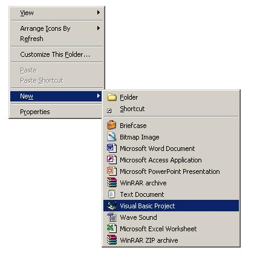



## VBPNewHandler

### Description

'VBP Project File on Explorer New Menu.

'	This Program creates a submenu in Explorer New Menu 'New Visual Basic Project'

'	and creates a VB Project with froms &amp; Modules in any folder you wants.

'	You can create VB Projects in an easy way.

'	I think it is very useful to you.

'you can freely use this code anywhere.But I wants you must include the Copyright Info

'some of the functions from PSC

'What to do : - Compile &amp; Make the Project &amp; Run the EXE,Right click in Explorer Select New-&gt;New isual Basic Project

' 

----

'I Will include comments &amp; help after a few days.Please wait.

'Please Send Your feedbacks to me about bugs and doubts.I will correct it next time.

'Please..........Vote my program...
 
### More Info
 

             |
---                |---
**Submitted On**   |2007-05-21 19:45:00
**By**             |[Joshy Francis](https://github.com/Planet-Source-Code/PSCIndex/blob/master/ByAuthor/joshy-francis.md)
**Level**          |Advanced
**User Rating**    |4.0 (12 globes from 3 users)
**Compatibility**  |VB 6\.0
**Category**       |[Windows API Call/ Explanation](https://github.com/Planet-Source-Code/PSCIndex/blob/master/ByCategory/windows-api-call-explanation__1-39.md)
**World**          |[Visual Basic](https://github.com/Planet-Source-Code/PSCIndex/blob/master/ByWorld/visual-basic.md)
**Archive File**   |[VBPNewHand2066915222007\.zip](https://github.com/Planet-Source-Code/joshy-francis-vbpnewhandler__1-68653/archive/master.zip)

